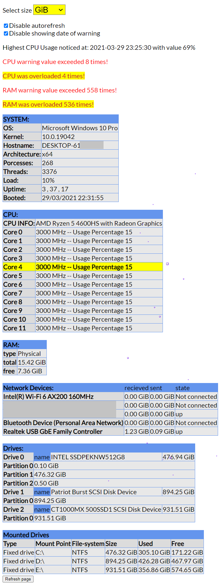

# linfo - app for monitoring computer/server
App displays info about system and saves available data to database. Web app can inform about CPU and RAM overload.

## Requirements
- XAMPP (Apache, MySQL)
- PHP 5.6.40 or similar
- Linfo 2.0.3 libraries (already in project)

## Example


## Setting up
To set up database, run queries in database from path `src/sql/createDB.sql`.

Move app folder to htdocs folder of XAMPP.

It's required to modify `php.ini` of XAMPP. Click `Config` nex to Apache. Click on `PHP (php.ini)`. Append to file:
```
[COM_DOT_NET]
extension=php_com_dotnet.dll
``` 

After running Apache and MySQL from XAMPP you can access web app by typing into browser:
```
localhost/linfo/src/php/app.php
```

## Database structure

**CPU table:**
| idCPUINFO                                 | Model                                | MHz                       | UsagePercentage           | CPUDate           |
|-------------------------------------------|--------------------------------------|---------------------------|---------------------------|-------------------|
| int(10) unsigned AUTO_INCREMENT not null  | varchar(100) not null utf8_polish_ci | int(10) unsigned not null | int(10) unsigned not null | datetime not null |

**Drives table:**
| idDrives                                 | Name                                 | Vendor                              | Device                              | DeviceSize          | Free       | Used       | DriveDate         |
|------------------------------------------|--------------------------------------|-------------------------------------|-------------------------------------|---------------------|------------|------------|-------------------|
| int(10) unsigned AUTO_INCREMENT not null | varchar(100) not null utf8_polish_ci | varchar(50) not null utf8_polish_ci | varchar(50) not null utf8_polish_ci | bigint(20) not null | bigint(20) | bigint(20) | datetime not null |

**Network table:**
| idNetworkDevices                         | Name                                 | ReceivedBytes                       | SentBytes                           | Status                              | DeviceType                          | NetworkDate       |
|------------------------------------------|--------------------------------------|-------------------------------------|-------------------------------------|-------------------------------------|-------------------------------------|-------------------|
| int(10) unsigned AUTO_INCREMENT not null | varchar(100) not null utf8_polish_ci | varchar(22) not null utf8_polish_ci | varchar(22) not null utf8_polish_ci | varchar(22) not null utf8_polish_ci | varchar(22) not null utf8_polish_ci | datetime not null |

**Ram table:**
| idRAM                                    | Total                               | Free                         | RAMDate           |
|------------------------------------------|-------------------------------------|------------------------------|-------------------|
| int(10) unsigned AUTO_INCREMENT not null | varchar(22) not null utf8_polish_ci | bigint(20) unsigned not null | datetime not null |

**System table:**
| idSYSTEM                                    | Hostname                             | Processes                 | Threads                   | SystemLoad                          | Uptime                               | SystemDate        |
|------------------------------------------|--------------------------------------|---------------------------|---------------------------|-------------------------------------|--------------------------------------|-------------------|
| int(10) unsigned AUTO_INCREMENT not null | varchar(100) not null utf8_polish_ci | int(10) unsigned not null | int(10) unsigned not null | varchar(22) utf8_polish_ci not null | varchar(100) utf8_polish_ci not null | datetime not null |

## Configuration
It's possible to determine app behaviour editing configuration.json for following features:
- bytes - default size of presented bytes
- time - time in miliseconds to refresh the page
- CPUwarning - how many % of CPU load to note it as warning
- CPUmax - how many % of CPU load to note it as overload
- RAMwarning - how many % (as float) of RAM load (Free / Total) to note it as warning
- RAMmax - how many % (as float) of RAM load (Free / Total) to note it as overload
RAM float number presents how much of free space left.

## Features
- App refreshes at time given in config.json. Every refresh creates sqls, saving and reading data from database.
- Disabling refreshing web app after clicking on checkbox.
- Disabling detailed date after overloading CPU or RAM.
- Recalculating bytes into selected (GiB, MiB, kiB, B).
- Boobles under mouse cursor.
- Hovering over table row makes it yellow.

## Known issues
- It was not possible to determine used and free space of drives, it was possible only for partitions. It affects database table `drives`, free and used size equals 0.
- CPU usage not shown properly for each thread/core.